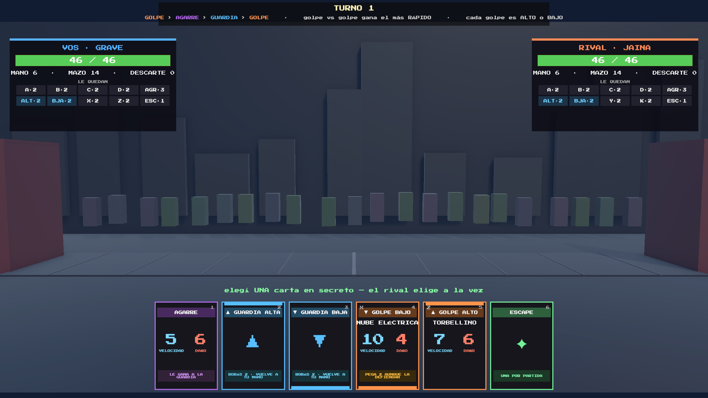
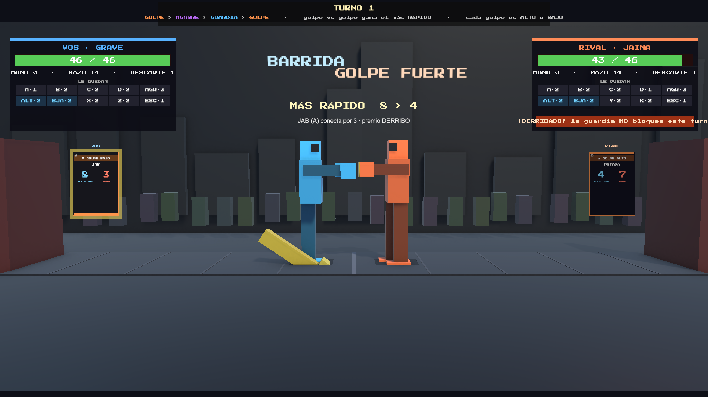
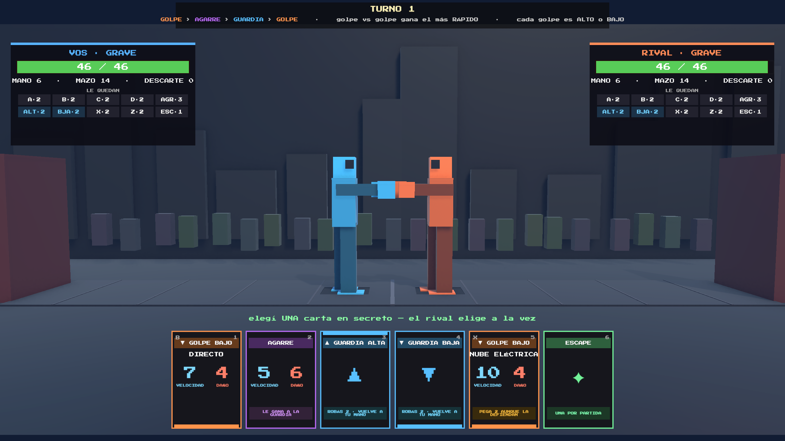
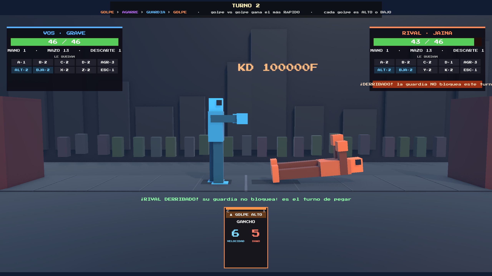
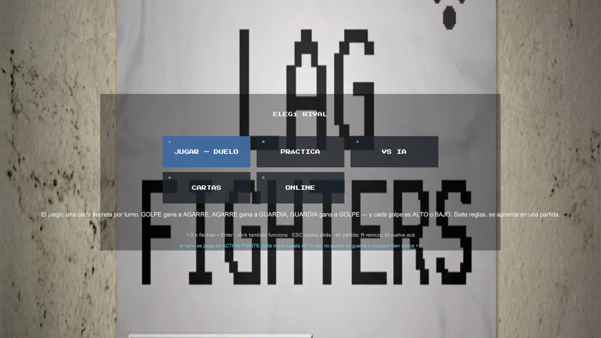

# DUELO — dirección de arte (2026-07-25)

> Escrito después de correr DUELO en el editor y capturar las cinco pantallas
> del ciclo (planificación, premio, teatro, derribo, menú). Las capturas están
> en `.claude/screenshots/`. Continúa —no reemplaza— la dirección "NETPLAY
> ROTO" de [UI_PLAN.md](UI_PLAN.md) §2, pero la vuelve **literal y
> estructural** en vez de una vibra.

## Estado de implementación (2026-07-25, misma tarde)

**L-1 a L-6 IMPLEMENTADAS y verificadas en el editor** (150 tests en verde).

| Fase | Estado |
|---|---|
| **L-1 Cromo** | ✅ paleta `Duelo` en `UIKit.cs` (verbos fuera del celeste/naranja), Barlow Condensed para datos y párrafos, escala mínima 14, paneles opacos con brackets, texto que se auto-achica en vez de desbordar, y los cuatro restos del clásico borrados |
| **L-2 El feed** | ✅ `ArenaBuilder.SetDuelStage()`: fuera skyline, paredes y líneas de distancia; público en negro puro; dos discos de luz en el piso; cámara a (0, 0.85, −6) y `DuelSlot` 0.62 → 1.7 |
| **L-3 Los cuerpos** | ✅ `FighterViewDuel.cs`: 12 poses propias, tres tiempos con la consecuencia que PERSISTE, ticks del eje alto/bajo, zona golpeada que se enciende, placa de guardia que se parte |
| **L-4 Foco por fase** | ⚠️ parcial: la mano se **atenúa** en vez de cerrarse durante la revelación. Falta el slot de compromiso y el hover = preview en el cuerpo |
| **L-5 Ceremonia** | ✅ pantalla de resultados con daño hecho, guardias acertadas, derribos y turnos, con REVANCHA / SALIR clickeables |
| **L-6 Personajes** | ✅ proporciones por personaje (Jaina alta y flaca, Golem bajo y ancho) — gratis, el rig es procedural |

Pendiente de la propuesta original, por orden de valor:

1. **Slot de compromiso** (click = la carta sale boca abajo, ENTER confirma).
2. **Hover = preview de la zona** en el cuerpo del rival.
3. **Outline** de los peleadores (inverted hull) — con el fondo oscuro se
   despegan bastante bien, así que bajó de prioridad.
4. **Scanline** sobre el cromo y el glitch del SYNC.
5. El **menú de modos**, que sigue con el panel gris translúcido sobre la foto.

## 0. Qué se ve hoy (diagnóstico con la pantalla adelante)



Siete problemas, ordenados por cuánto pesan:

1. **El 55% de la pantalla no hace nada.** Entre el HUD de arriba y la mano de
   abajo hay un escenario 3D —skyline, público, paredes, líneas de piso— que
   en DUELO no participa: `SimConfig.DuelTheaterEnabled = false`, así que los
   peleadores ni aparecen. Es un fondo de pantalla que compite en contraste
   con lo único que importa. **El juego se ve como una UI flotando sobre la
   captura de otro juego.**
2. **Colisión cromática lado vs. verbo.** VOS es celeste y RIVAL es naranja;
   GUARDIA es celeste y GOLPE es naranja. En mi propia mano las cartas de
   golpe se ven "del rival". El sistema de color está haciendo dos trabajos
   incompatibles al mismo tiempo.
3. **Todo pesa igual.** Dos paneles de 452px, el header de reglas, el prompt
   verde, las cartas dockeadas, el veredicto y los badges están todos a
   contraste máximo, siempre. No hay un momento en el que la pantalla diga
   "mirá ACÁ".
4. **Escala de texto de debug.** Los chips de "LE QUEDAN" —que son *la Ley 5
   hecha interfaz*, o sea la fuente de profundidad #3 del juego— son de 11px
   sobre 1920. Las etiquetas VELOCIDAD/DAÑO, 8px. Nada de eso se lee sin
   acercarse.
5. **Dos vocabularios en pantalla a la vez.** El teatro grita "BARRIDA" y
   "GOLPE FUERTE" (nombres del modo clásico) mientras el veredicto dice "JAB
   (A) conecta por 3". Y los dos carteles se pisan entre sí.
   
6. **Restos del HUD clásico.** El badge `KD 100000F` flotando en el medio del
   escenario y la línea "último turno: AGARRE vs AGARRE — vos −0 · rival −0"
   (que además contradice al veredicto).
7. **Cero identidad.** Paneles negros translúcidos + borde de color + pixel
   font es exactamente el look que tiene todo prototipo de Unity. Un
   screenshot de DUELO hoy no se distingue de cualquier otro card battler.

Lo que **sí** funciona y no hay que tocar: la carta como objeto (las tres
redundancias —posición de la barra de altura, color por verbo, números
enormes— son un acierto), la ceremonia de revelación (dorso → respiro →
flip → veredicto), y el strip de descarte público como concepto.

## 1. Referencias: qué robarle a cada una

| Referencia | Qué hace bien | Qué robamos para DUELO |
|---|---|---|
| **Into the Breach** | Información perfecta EN el tablero: la intención del enemigo se dibuja en la casilla, no en un tooltip | Hover de carta = **la zona del rival se enciende** (alto/bajo) en el escenario. Las alturas dejan de ser una palabra y pasan a ser un lugar del cuerpo |
| **Slay the Spire** | El abanico como objeto físico: la carta hovereada crece, se separa y manda | Ya está copiado. Falta el **slot de compromiso** (la carta elegida sale de la mano y queda boca abajo) |
| **Marvel Snap** | La revelación como espectáculo: se apaga todo, la carta ocupa la pantalla, el resultado se canta | Bajar el resto de la UI a 25% durante el reveal. Hoy compite con dos paneles a full |
| **Street Fighter 6** | Jerarquía brutal: vida enorme, lenguaje de color estricto, el daño aparece donde pega | Vida como primer ciudadano, y **un solo elemento a contraste máximo por fase** |
| **Guilty Gear Strive** | Tipografía como identidad (condensada, pesada, diagonal) y KO como evento gráfico, no como pantalla de "ganaste" | El sistema tipográfico y la ceremonia de KO |
| **Punch-Out!!** | El rival es un **telégrafo con piernas**: cada estado tiene una pose inconfundible y la pose PERSISTE | El núcleo de §3: los peleadores como marcador de estado |
| **Frozen Synapse** | Turnos simultáneos con look propio por fase (frío al planificar, en vivo al ejecutar) | La cinta de fase y el cambio de temperatura de la pantalla |
| **Footsies** | Si no decide la ronda, no está en pantalla | Podar el escenario entero |
| **Nidhogg / Lethal League** | Siluetas planas de dos colores que se leen a 30cm o a 3m | El tratamiento de los blockmen |
| **Yomi / Yomi 2** (Sirlin) | Es el papá del género, pero su look es **de mesa**: ilustración por personaje, carta como objeto de cartón | Lo que NO hacemos: no compitamos en ilustración, no tenemos artista. Nuestra ventaja es que somos un juego de PELEA con cuerpos en pantalla |

La conclusión importante de la última fila: **el diferencial de DUELO contra
Yomi es que acá los cuerpos existen.** Hoy están apagados. Encenderlos bien
es la mitad de esta propuesta.

## 2. El theme: **"SALA DE ESPERA"** (netplay roto, en serio esta vez)

El mecanismo del juego ya es el tema y nadie lo dijo en voz alta: **los dos
tiran al mismo tiempo y el juego decide después.** Eso es lag. Eso es
rollback. El nombre del juego ya venía diciéndolo.

Entonces la ficción de DUELO es: **una pelea de sótano transmitida por un
stream que se cuelga.** La pantalla no es "un juego de pelea", es **el
overlay de una transmisión**:

- El escenario es un **feed de video**: cuarto oscuro, una luz dura desde
  arriba, dos siluetas. Nada de skyline ni público de colores.
- El HUD es **chrome de stream**: marcos de 2px con brackets en las esquinas,
  ping, "REC", nombres como tags de conexión (VOS / RIVAL ya lo son).
- Las cartas son tu **buffer de input**: las guardás, se envían al mismo
  instante que las del rival.
- La revelación es el **SYNC**: llegan los dos paquetes y el mundo se
  reconcilia. Ahí es donde vive el único glitch permitido —chroma shift,
  scanline que salta, un frame congelado— y por eso el glitch **significa
  algo** en vez de ser decoración.
- El derribo, el time over y el KO son eventos de la transmisión: lower-third
  con el veredicto, wipe de "REPLAY", corte a negro.

**La regla que lo mantiene honesto:** el glitch vive en el chrome, nunca en
el escenario ni en los cuerpos. La sim es sagrada; la transmisión es la que
se rompe. (Es la misma regla que ya está escrita en UI_PLAN §2.)

### Runner-up descartado (por si alguien lo pregunta)

**"Afiche de box"** — tinta plana, 3 colores, halftone, tipografía condensada
gigante, papel roto. Es hermoso y barato de hacer procedural, pero pelea con
la pixel font (que ya es identidad y ya está pagada) y con la cámara 3D. Si
algún día se cambia de fuente, es la dirección a la que iría.

## 3. Paleta

La regla que arregla el problema #2 del diagnóstico:
**el color de lado y el color de regla son dos idiomas separados y no se
pisan.** El lado se dice con celeste/naranja SOLO en cromo de identidad
(nombre, barra de vida, borde del panel, luz del peleador). Las reglas del
juego se dicen con otra familia entera.

### Cromo (el 90% de los pixeles)

| Rol | Hex | Uso |
|---|---|---|
| Void | `#070A10` | fondo de pantalla, fondo de panel (opaco, no translúcido) |
| Stage | `#101725` | piso y paredes del cuarto |
| Stage-lit | `#1C2740` | el cono de luz del centro |
| Línea | `#2B3A55` | bordes de panel, separadores, grilla |
| Texto | `#EAF0FA` | blanco fósforo, nunca `#FFFFFF` |
| Texto mute | `#8494AD` | etiquetas, ayudas, todo lo secundario |

### Identidad de lado (solo cromo)

| Rol | Hex |
|---|---|
| VOS (P1) | `#3FB6F5` |
| RIVAL (P2) | `#FF7A3C` |

### Reglas del juego (el triángulo + estados) — **estos mandan**

| Concepto | Hex | Por qué |
|---|---|---|
| GOLPE | `#FF3B30` rojo | atacar = rojo, y coincide con el número de DAÑO |
| AGARRE | `#B15CFF` violeta | ya era magenta, se corre para separarlo del naranja de lado |
| GUARDIA | `#FFC53D` ámbar | libera el celeste (que era del lado) y hereda el ámbar de guard gauge del clásico |
| ESCAPE | `#4BE08A` verde | válvula / salida |
| VELOCIDAD | `#5AC8FA` cian | el número azul, único uso de celeste fuera de identidad — va **solo en el numeral**, nunca en un fondo |
| Ceremonia (ganador, KO, premio) | `#FFE45C` dorado | el único color que aparece poco y por eso pesa |
| Peligro / derribado | `#FF3B30` sobre rayado negro | mismo rojo que GOLPE: te derribó un golpe |

Comparado con hoy: GOLPE deja de ser naranja (chocaba con RIVAL) y GUARDIA
deja de ser celeste (chocaba con VOS). Es un cambio de dos constantes en
`DuelHandUI.VerbColor` y arregla el malentendido más caro de la pantalla.

## 4. Tipografía y escala

Dos fuentes, roles sin superposición:

- **Display — Press Start 2P** (la que ya está): nombres de carta, veredicto,
  VS, KO, números de VELOCIDAD/DAÑO, contadores. Siempre mayúsculas.
- **Datos y explicaciones — una condensada OFL** (Barlow Condensed o Oswald,
  se importan igual que PressStart2P a `Resources/LagFighter/`): chips de
  keyword, panel de detalle, prompts, tooltips. Condensada = entra más texto
  al doble de tamaño.

**Escala mínima, en unidades del canvas de 1920×1080:**

| Elemento | Hoy | Propuesto |
|---|---|---|
| Veredicto | 26 | 44 |
| Nombre de carta | 12 | 18 |
| Números vel/daño | 32 | 40 |
| Etiquetas VELOCIDAD/DAÑO | 8 | 14 |
| Chips de keyword | 8 | 15 (condensada) |
| Chips de "LE QUEDAN" | 11 | 18 + pictograma |
| Prompt de fase | 14 | 20 |

Regla dura: **nada por debajo de 14**. Si no entra, es que el layout está
mal, no la fuente.

### Bug tipográfico real (visible en las capturas)

Press Start 2P dibuja las **mayúsculas acentuadas más chicas** que el resto
—no le entra el diacrítico arriba de la caja de 5px— así que en pantalla se
lee `DAñO` y `NUBE ELéCTRICA`. Tres salidas, en orden de preferencia:

1. Mandar todo texto con Ñ/acentos a la fuente condensada (que es a dónde va
   a ir igual: son etiquetas y explicaciones).
2. Evitar acentos en los labels display (`VELOCIDAD` está bien, `DAÑO` no —
   pero "DAÑO" no se puede evitar sin escribir mal).
3. Cambiar la display por una pixel con caja alta (VT323 y m6x11 dibujan
   Ñ/É de tamaño completo).

## 5. Los peleadores: **marcador de estado, no actores**

Este es el punto que el usuario pidió y es donde está la mayor ganancia.

El teatro se apagó el 2026-07-25 por la razón correcta: **las animaciones
heredadas del modo clásico mienten.** Cuentan una pelea de frames que en
DUELO no existe, con nombres de otro modo, en 90 frames que terminan
volviendo a idle —o sea, que después de contar la historia **borran la
historia**. En un juego por turnos, la pose que QUEDA es la información.

### 5.1 Las tres preguntas

Los cuerpos existen para contestar tres cosas **sin una palabra de texto**:

1. ¿Qué pasó recién? (quién ganó el intercambio y por qué)
2. ¿En qué estado estoy AHORA? (derribado / escape gastado / vida baja)
3. ¿Dónde pega esto? (alto o bajo — el eje de adivinanza del juego)

### 5.2 Encuadre y silueta

- **Separarlos y agrandarlos.** Hoy están en `DuelSlot = 0.62` (a 1.24u de
  distancia): los brazos se interpenetran y ocupan el 15% del alto de la
  pantalla. Propuesto: **±2.2u**, cámara más cerca y más baja, los cuerpos
  ocupando ~45% del alto de la franja de escenario.
  
- **Outline negro** (inverted hull, ya propuesto en VISUAL-IDEAS §11): los
  despega del fondo sin post-proceso, o sea banca WebGL.
- **Contraluz por lado** (las point lights celeste/naranja que ya existen)
  con el cuerpo casi plano: silueta primero, volumen después.
- **La línea ALTO/BAJO dibujada en el cuerpo**, siempre visible: una banda
  sutil a la altura de la cintura que parte al peleador en dos zonas. Ese eje
  es *el juego entero* y hoy no está en ningún lado del mundo 3D.

### 5.3 Ritmo de tres tiempos (en vez de 90 frames de animación)

| Tiempo | Duración | Qué pasa |
|---|---|---|
| **Anticipación** | ~0.35s congelado | los dos se cargan **al mismo tiempo** (es reveal simultáneo, no hay turno activo). Silueta cargada hacia atrás, sin decir todavía el verbo |
| **Impacto** | hitstop 0.25s | flash blanco de pantalla, la **zona golpeada se enciende** (cabeza+torso si fue ALTO, cadera+piernas si fue BAJO), el número de daño sale de esa zona |
| **Consecuencia** | **hasta el próximo reveal** | la pose no vuelve a idle: el que perdió queda tambaleado / en el piso / con la guardia rota. La pantalla sigue contando lo que pasó mientras vos pensás el turno siguiente |

Ese tercer tiempo es todo el cambio conceptual. Hoy el teatro es un video que
se reproduce y se olvida; tiene que ser **una foto que se actualiza**.

### 5.4 Vocabulario de estados (la tabla de entrega)

Seis poses propias, una por verbo del juego. Nada de hadouken/shoryuken/tatsu.

| Estado | Pose / cuerpo | Marca en el mundo | Color |
|---|---|---|---|
| **Neutral** | guardia arriba, respiración | — | lado |
| **Comprometido** (ya elegiste, falta el rival) | congelado a mitad de carga, silueta más oscura | carta boca abajo flotando al lado del cuerpo | lado 60% |
| **GOLPE ALTO** | puño a la cabeza; el brazo termina arriba de la línea | arco de golpe en la zona alta | rojo |
| **GOLPE BAJO** | barrida/gancho al cuerpo; termina abajo de la línea | arco en la zona baja | rojo |
| **AGARRE** | brazos abiertos y cierre de pinza, se tira adelante | el rival es *arrastrado* medio metro | violeta |
| **GUARDIA (acertada)** | placa de escudo sobre **la mitad cubierta** del cuerpo | chispas ámbar + **2 cartas volando a tu mano** | ámbar |
| **GUARDIA (errada)** | la placa está en la mitad equivocada y **se rompe**; el golpe pasa por encima/por debajo | el escudo cae en pedazos | rojo sobre ámbar |
| **DERRIBADO** | en el piso, **todo el turno siguiente** (ya está así en el código) | contorno de tiza en el piso + **ícono de escudo tachado** sobre el cuerpo | rojo |
| **ESCAPE gastado** | (sin pose) | ficha ESCAPE apagada bajo los pies, para siempre | gris |
| **TECH** (agarre vs agarre) | los dos rebotan hacia atrás, simétrico | "TECH" entre los dos, al centro | blanco |
| **AGUANTE** (armor del Golem) | **no retrocede**: come el golpe sin moverse un pixel | onda de impacto que se disuelve en el cuerpo | ámbar |
| **CAMBIO** (trade) | los dos golpean y los dos retroceden | los dos números de daño salen a la vez | rojo × 2 |
| **Vida baja** (<25%) | encorvado, respiración pesada, guardia más baja | — | rojo tenue |
| **Ganador del intercambio** | sostiene la pose de golpe, pie adelantado | destello dorado que decae | dorado |

El derribado ya se ve bien en concepto pero la pose actual es un desarme de
bloques sueltos: hay que rehacerla como **una silueta legible tirada en el
piso**, no como el rig neutral rotado −85°.


### 5.5 Identidad de personaje: gratis con el rig procedural

GRAVE, JAINA y GOLEM hoy son el mismo muñeco con el mismo color. El rig se
construye por código (`FighterView.BuildRig`), así que **cambiar
proporciones sale cero**:

| Personaje | Silueta | Emblema |
|---|---|---|
| **GRAVE** — el que controla el espacio | proporción media, brazos largos | ◆ rombo eléctrico |
| **JAINA** — la que apuesta | alta y flaca, piernas largas, cabeza chica | ▲ filo |
| **GOLEM** — el grappler | **bajo y ancho**, torso el doble, brazos gruesos, +8 de vida se LEE en el cuerpo | ⬢ bloque |

Con eso, "estoy peleando contra el Golem" se sabe de un vistazo, que hoy sólo
se sabe leyendo el panel.

## 6. UI style

- **Paneles opacos, nunca translúcidos sobre 3D.** El menú de hoy es un gris
  al 55% sobre una foto de pared: el texto queda ilegible.
  
- Borde de 2px del color de la sección + **brackets en las esquinas** (4
  tickitos de 10px). Cero esquinas redondeadas.
- **Scanline** de 2px generada en runtime, alfa ~0.06, **solo sobre el
  chrome**.
- **Pictogramas** (ya existe la fábrica en `UIKit.MoveIcons`): ampliar a los
  ocho símbolos que son el idioma del juego — GOLPE ALTO, GOLPE BAJO, AGARRE,
  GUARDIA ALTA, GUARDIA BAJA, ESCAPE, DERRIBO, ROBO. Con eso el strip "LE
  QUEDAN" deja de ser `A·2 B·2 C·2` (críptico) y pasa a ser icono + número.
- **Layout propuesto** (canvas 1920×1080):

```
┌──────────────────────────────────────────────────────────┐
│ cinta de fase: ESPERANDO ─ SYNC ─ RESOLUCIÓN   ping 0ms  │  32px
├───────────────────────┬──────────────────────────────────┤
│ VOS · GRAVE  ████████ │ ████████  RIVAL · JAINA          │ 120px  vida enorme, enfrentada al centro
│ ◆46/46  mazo·descarte │  mazo·descarte  46/46 ▲          │
├───────────────────────┴──────────────────────────────────┤
│                                                          │
│        [silueta VOS]   ·luz·   [silueta RIVAL]           │  520px  EL FEED
│         ──línea alto/bajo──                              │
│        estado bajo los pies    estado bajo los pies      │
├──────────────────────────────────────────────────────────┤
│ LE QUEDAN (iconos grandes)  │  LE QUEDAN (iconos grandes) │  90px
├──────────────────────────────────────────────────────────┤
│              ▣ ▣ ▣ ▣ ▣ ▣   la mano                       │  300px
└──────────────────────────────────────────────────────────┘
```

El escenario pierde el skyline, el público de colores y las paredes rojas.
Queda: piso oscuro, un **cono de luz** en el centro, público en **silueta
negra pura** (los bloques que ya saltan, pintados de negro: aportan vida y
cero ruido).

## 7. UX style

1. **Un foco por fase.** En cada momento hay UN elemento a contraste máximo y
   el resto baja a 35-40% de alfa:

   | Fase | A full | Atenuado |
   |---|---|---|
   | Planificar | la mano | escenario, paneles, header |
   | Revelar | las dos cartas al centro | **todo** lo demás, incluido el escenario |
   | Resolver | los cuerpos + el veredicto | la mano (dockeada), los paneles |
   | Premio | los dos botones | todo lo demás |

2. **Slot de compromiso.** Click en una carta = la carta sale de la mano y
   queda boca abajo en un slot frente a tu peleador; ENTER o segundo click
   confirma. Da el ritual del reveal simultáneo, permite arrepentirse y saca
   los mis-clicks (hoy un click resuelve el turno entero).

3. **Hover = preview en el cuerpo del rival.** Pasar por GOLPE ALTO enciende
   la zona alta del rival; por GUARDIA BAJA enciende la mitad baja del tuyo.
   Es Into the Breach y es lo que hace que las alturas se entiendan por
   intuición espacial en vez de por lectura.

4. **La información pública tiene que gritar.** El strip "LE QUEDAN" es la
   fuente de profundidad que el lab midió como más floja (+1.9pp). Si el
   dial de diseño ya está apretado, el otro dial es **de presentación**:
   cuando al rival se le acaban las guardias altas, que el chip se apague con
   un flash y quede tachado. Que la lectura sea imposible de no ver.

5. **Ceremonia de cierre.** Hoy el KO en DUELO no tiene nada (el cartel de
   ROUND está desactivado a propósito). Hace falta: freeze + flash + lower
   third con "KO", y después una **pantalla de resultados** —turnos, daño
   máximo, guardias acertadas, veces que leíste bien— con REVANCHA / MENÚ en
   botones grandes.

## 8. Bugs de look encontrados en esta pasada

| # | Qué | Dónde |
|---|---|---|
| 1 | Badge `KD 100000F` flotando en el escenario en modo DUELO | HUD clásico filtrándose; ver `HudUI` badges de estado |
| 2 | Línea "último turno: AGARRE vs AGARRE — vos −0 · rival −0", stale y contradictoria con el veredicto | recap del clásico, apagarlo con `SetDuelChrome` |
| 3 | Los carteles de move ("BARRIDA", "GOLPE FUERTE") se superponen entre sí y usan nombres de otro modo | `FighterView` callout + `WorldFX.LaneCallout`: los peleadores están a 1.24u y el umbral de apilado es 0.9 |
| 4 | Badge "¡DERRIBADO! la guardia NO bloquea este turno" **cortado** por el borde derecho de la pantalla | `DuelHudUI._badgeLbl`, texto más ancho que el panel |
| 5 | `DAñO` y `NUBE ELéCTRICA`: mayúsculas acentuadas enanas | Press Start 2P, ver §4 |
| 6 | El nombre de carta desborda el ancho de la carta ("NUBE ELÉCTRICA") | `PaintCard`, `HorizontalWrapMode.Overflow` sin escala adaptativa |
| 7 | El texto del chip de keyword desborda el chip ("PEGA 2 AUNQUE LA DEFIENDAN") | ídem |
| 8 | Las cartas dockeadas a ±700 se montan sobre los paneles de los lados | `DuelHudUI.DockNow` |
| 9 | Los peleadores se interpenetran (brazos cruzados) al estar a 1.24u | `DuelSlot` |

Los 1-4 son restos de otro modo y se arreglan borrando, no agregando.

## 9. Orden de implementación

| Fase | Contenido | Por qué primero |
|---|---|---|
| **L-1 Cromo** | paleta nueva (verbos fuera del celeste/naranja), dos fuentes, escala mínima 14, paneles opacos con brackets, borrar los restos del clásico (bugs 1-4) | Es el 80% de la percepción y no toca gameplay. Una sesión |
| **L-2 El feed** | escenario oscuro con cono de luz, público en silueta, skyline afuera, outline en los peleadores, `DuelSlot` ±2.2, cámara más cerca | Convierte el 55% muerto en escenografía |
| **L-3 Los cuerpos** | teatro ON otra vez pero con el vocabulario de §5.4: 6 poses propias, tres tiempos, **pose que persiste**, línea alto/bajo en el cuerpo, zona golpeada que se enciende | Es lo que diferencia a DUELO de un card battler |
| **L-4 Foco por fase** | atenuación por fase, slot de compromiso, hover = preview en el cuerpo | UX, y depende de que L-2/L-3 existan |
| **L-5 Ceremonia** | KO, pantalla de resultados, revancha | Cierra el loop |
| **L-6 Personajes** | proporciones por personaje, emblemas, color propio | Barato y da mucha personalidad, pero puede esperar |

Regla de siempre: **L-3 no se abre hasta que L-2 esté**, porque los cuerpos
sobre el escenario de hoy van a volver a leerse como ruido — que es
exactamente por lo que se apagaron.
